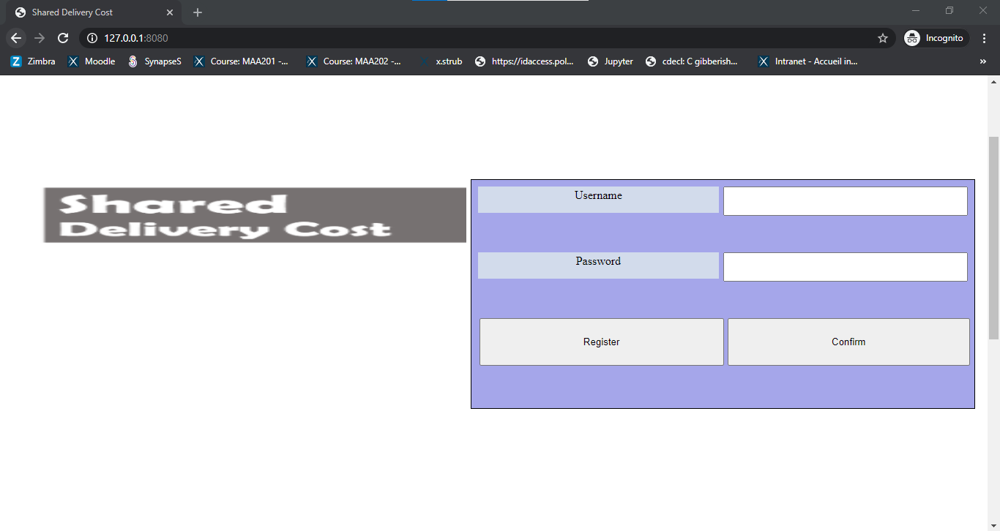
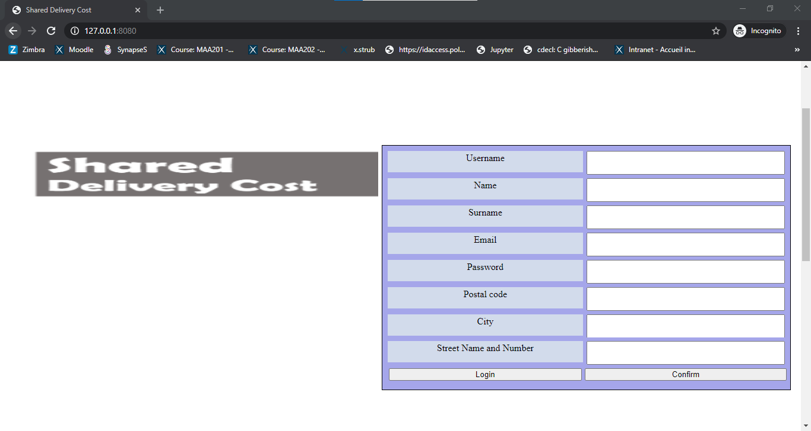
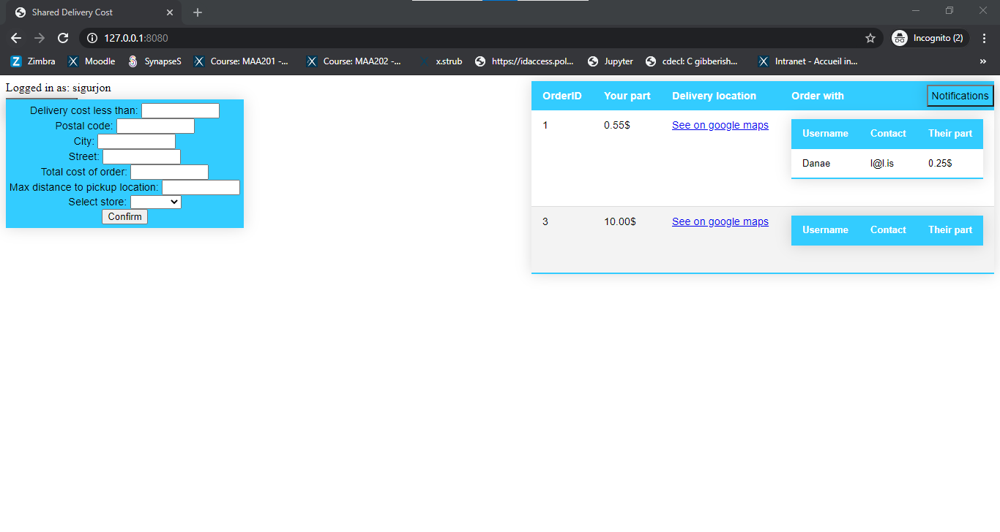

# SharedDeliveryCost-CSE201Project

The SharedDeliveryCost web application will allow users to get connected with other users in order to make a group delivery from a company, by that decreasing the delivery costs they need to pay.

The application allows you to:

1. Register and log in as a user. Giving the following information:
   - email address (used for log in and future contacting)
   - password
   - Name and Surname (username)
   - Default location
2. Make an order by giving the following informations:
   - company the user wants to order from (ex. Ikea)
   - amount of his order
   - how much he is willing to pay for the shipping cost
   - location (if different from him default one)
   - distance willing to go to pick up his order (ex. None- for big objects, 500m for something small)
3. Recieve a notification when their order has been grouped. This contains:
   - The contact information of the people you were grouped in order to share your delivery
   - The portion of the delivery you are going to pay
   - An address for the delivery taking into account the "locations" and "willingness to go" from all included parties

## Members (name surname, github username, trello username, [role])

- Gorazd Dimitrov, gogodim, gorazddimitrov, Project leader
- Maika Edberg, maikaedberg, maikaedberg, Localiation leader
- Sigurjon Agustsson, SigurjonAg, sigurjonagustsson, Databases and server leader
- Danaé Broustail, danaebroustail, danaebroustail, Back-end leader
- Yarou Hsu, yarou1025, yarou1025, Trello leader
- Leonardo Israilovici, leoisrailovici, leonardoisrailovici, Optimization leader
- Estelle Martin, estellemartin, estellemartin20, Git leader

## Running the project

### Prerequisites
- QT Creator
- Boost library bundle installed (Version 1_67: ```https://www.boost.org/users/history/version_1_67_0.html```)
- WT library (installation guide for Windows provided in the repository in ```Install_WT.md```)
- OpenSSL installed and added to path on machine (Windows: ```https://medium.com/swlh/installing-openssl-on-windows-10-and-updating-path-80992e26f6a1```)

Remark: Beware, both boost and WT library take a while to build (around an hour and a half).

### Other set-ups, building and running

Run the project in Qt Creator by following the steps below:

1. Command line arguments

Go to the "Projects" section on the left sidebar in QT after having opened the project. Under the MinGW 64-bit compiler go to "Run" and adjust the command line arguments by modifying the following line:
```
--docroot="path_to_project\\SharedDeliveryCost-CSE201Project\\SDC\\SDC" --http-port=9090 --http-address=0.0.0.0 ---config wt_config.xml --resources-dir="path_to_the_parent_directory_of_project"
```
2. Clearing old Database

Delete the "SDB.db" file from "SharedDeliveryCost-CSE201Project/SDC/SDC" in order for the system to create it by itself at the first running of the project on a new machine.

3. Compiler

Make sure you are using the right compiler by choosing MinGW 64-bit under "SDC Debug" right above the green "Run" button on the left sidebar.

4. Build and run the project directly from Qt.

## Testing and examples

After running the project we reccomend registering few users, and then creating at least 1 order from each of the users. After doing that we reccoment you log-in again to he users to see if you got any notifications about a matched order. 

Things to keep in mind:

- The functionality of entering another address for the order is under construction, so we reccomend you don't use the future, as it will just take the default user address that you entered when you created the user. (Notice: The origram won't crush, but it may confuse you to the fact that you are not getting the expected result)

- In order to get 2 or more orders matched then must be from the same company, and must be in range from each other, this means that there is an intersection between them taking into account the default location and the willingness to walk (radius) for the order.

- We reccomend downloading a DB Browser (we use: https://sqlitebrowser.org/) and in it opening the "SDC.db" file from "SDC/SDC" in order to see what happens when you add an order.

- The distance of the radius is in meters, so make sure you give big enough radius so your orders can match.

- Example of a simpe match of orders for the company Ikea: 
   - User 1: maximum payment for delivery 0.6, order value 24, 
   - User 2: maximum payment for delivery 0.3, order value 16

- Currnetly working on a fix, but in the case of not fixing it before release: beware that the final location for the order is not correctly displayed, it can be found inside a print statement in the consloe or inside the database, but not in the google maps link we return in the end.

#### Warning

The project contains a big part of CSS ("resources" folder in "SDC/SDC") which is not written by the students, but comes with the Wt library, and is subject to copyright. This folder is present on the repository to easen the process of running the project and avoid complications that may occur if one must link the resources from the command line arguments.

### Pictures

#### Login page:



#### Register page:


#### main page:


